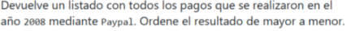
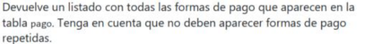
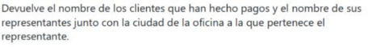
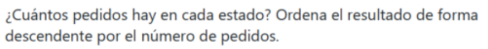
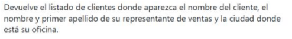

# Consultas

## C1

``` c#
    http://localhost:5254/api/Pago/PagosEn2008Paypal
```
``` c#
    public async Task<IEnumerable<Pago>> PagosEn2008Paypal()
    {
        var r = await context.Pagos.Where(p => p.Fecha_Pago.Year == 2008 && p.Forma_Pago.ToLower() == "paypal").OrderByDescending(p=>p.Total).ToListAsync();
        return r;
    }
```
En la variable r tomo los pagos donde el año de la fecha del pago sea 2008 y la forma de pago sea igual a paypal, luego los ordeno decrecientemente por su total

## C2

``` c#
    http://localhost:5254/api/Pago/PosiblesEstadosDePago
```
``` c#
    public async Task<IEnumerable<Pago>> PosiblesEstadosDePago()
    {
        var r = await context.Pagos.ToListAsync();
        return r.DistinctBy(p=>p.Forma_Pago).ToList();
    }
```
Aqui tomo las entidades y las filtro donde solo puedan haber objetos queno repitan Forma_Pago asi que solo me da 3 (En el caso de esta db) y luego mapeo el resultado con automaper

## C3

``` c#
    http://localhost:5254/api/Cliente/ClienteConRepNameYCiudad
```
``` c#
        public async Task<IEnumerable<Cliente>> ClientesQueHanHechoPagosJuntoConRepInfo()
        {
            var r = await context.Clientes
                .Where(p => p.Pagos.Count > 0)
                .Include(c => c.Empleado)
                .ThenInclude(c => c.Oficina)
                .ToListAsync();
            return r;
        }
```
Aqui tomo los clientes donde el count de la lista de pagos sea mayor a 0 lo que significa que ha hecho algun pago luego incluyo en la entidad Empleado con su Oficina para mapear la informacion solicitada despues

## C4

``` c#
    http://localhost:5254/api/Empleado/EmpleadoJefeConJefe
```
``` c#
    public async Task<IEnumerable<Empleado>> EmpleadoConJefeConJefe()
    {
        var r = await context.Empleados.Include(e=>e.Jefe).ThenInclude(e=>e.Jefe).ToListAsync();
        return r;
    }
```
Aqui simple mente cargo las entidades del jefe y del jefe del jefe para mappear la informacion deceada despues

## C5

``` c#
    http://localhost:5254/api/Producto/ProductosQueNoHanEstadoEnPedidos
```
``` c#
        public async Task<IEnumerable<Producto>> ProductosQueNoHanEstadoEnPedidos()
        {
            var ids = await context.Detalles_Pedidos.Select(p=>p.ProductoId).ToListAsync();
            var r = await context.Productos.Where(p => !ids.Contains(p.Id)).Include(p=>p.Gama_Producto).ToListAsync();
            return r;
        }
```
Aqui tomo las ids que estan en la tabla de  Detalles_Pedidos y luego tomo los pedidos que no aparescan en la lista de ids con !Contains y cargo Gama Producto para mappear luego la info deseada

## C6 (Repetida en el pdf)

``` c#
    http://localhost:5254/api/Producto/ProductosQueNoHanEstadoEnPedidos
```
``` c#
        public async Task<IEnumerable<Producto>> ProductosQueNoHanEstadoEnPedidos()
        {
            var ids = await context.Detalles_Pedidos.Select(p=>p.ProductoId).ToListAsync();
            var r = await context.Productos.Where(p => !ids.Contains(p.Id)).Include(p=>p.Gama_Producto).ToListAsync();
            return r;
        }
```
Aqui tomo las ids que estan en la tabla de  Detalles_Pedidos y luego tomo los pedidos que no aparescan en la lista de ids con !Contains y cargo Gama Producto para mappear luego la info deseada

## C7

``` c#
    http://localhost:5254/api/Pedido/PedidosPorEstado
```
``` c#
    [HttpGet("PedidosPorEstado")]
    public async Task<ActionResult<IEnumerable<object>>> PedidosPorEstado()
    {
        
        var Pedidos = await _unitOfWork.Pedidos.GetAllAsync();
        var r = Pedidos.GroupBy(x=>x.Estado).Select(x => new {Estado = x.Key,Total = x.Count()}).OrderByDescending(x=>x.Total).ToList();
        return r;
    }
```
Aqui tomo todos los pedidos que hay en la tabla luego los agrupo por Estado Luego selecciono un nuevo objeto anonimo con las propiedades estado que guarda la key del grupo(EstadoId) y Total que guarda la cantidad de pedidos del grupo luego la ordeno y retorno

## C8

``` c#
    http://localhost:5254/api/Cliente/ClientesQueNoHanRealizadoPagos
```
``` c#
    public async Task<IEnumerable<Cliente>> ClientesQueNoHanRealizadoPagos()
    {
        var r = await context.Clientes.Where(p => p.Pagos.Count == 0).ToListAsync();
        return r;
    }
```
Aqui tomo los clientes donde el numero d eobjetos en la lista de pago sea igual a 0 y la devuelvo  

## C9

``` c#
    http://localhost:5254/api/Cliente/ClientesJuntoConRepInfo
```
``` c#
        public async Task<IEnumerable<Cliente>> ClientesJuntoConRepInfo()
        {
            var r = await context.Clientes
                .Include(c => c.Empleado)
                .ThenInclude(c => c.Oficina)
                .ToListAsync();
            return r;
        }
```
Aqui Incliyo la entidad empleado luego la de oficina para luego mapear lo necesario con automapper

## C10

``` c#
    http://localhost:5254/api/Cliente/ClientesQueNoHanHechoPagosJuntoConRepInfo
```
``` c#
    public async Task<IEnumerable<Cliente>> ClientesQueNoHanHechoPagosJuntoConRepInfo()
    {
        var r = await context.Clientes
            .Where(p => p.Pagos.Count == 0)
            .Include(c => c.Empleado)
            .ThenInclude(c => c.Oficina)
            .ToListAsync();
        return r;
    }
```
Aqui tomo lois clientes que no tienen ningun pago cargo Empleado y luego oficina para mapear luego la informacion necesaria